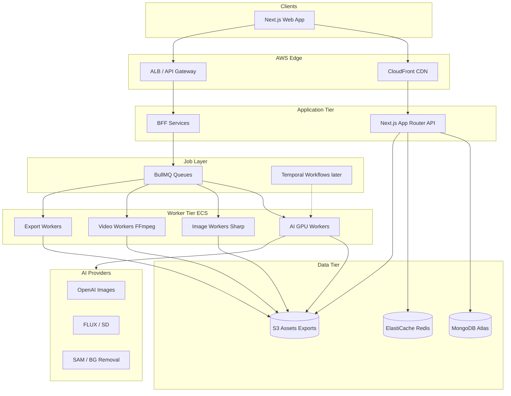

# SN Editor (SN Editor) — Architecture

> Greenfield AWS-first architecture for a Canva-class image editor and CapCut-style video editor, with AI as the core differentiator.

## Decisions locked

| Decision | Choice |
|----------|--------|
| Start | Full greenfield in `pixieditor-new-version` |
| Cloud | **AWS-first**: S3, ECS (GPU/CPU workers), Lambda, API Gateway / ALB, MongoDB Atlas |
| Product | **SN Editor** brand; editor product name **SN Editor** |
| Structure | **pnpm + Turborepo** monorepo |
| Image canvas | **Konva + react-konva** only (not Fabric + Konva together) |
| GPU path | **PixiJS** only where Konva is insufficient (large canvases, many layers, WebGL filters) |
| State | **Zustand** (editor) + **TanStack Query** (server data) |
| Video | CapCut-for-ads model: Preview / Timeline / Export separated |
| Queue | **BullMQ + Redis (ElastiCache)** for jobs; **Temporal** when multi-step AI workflows mature |
| Auth | Email + OAuth (NextAuth / Auth.js) |

---

## System architecture



### Design principles (first service + guaranteed service)

1. **Edit ≠ Preview ≠ Export** — UI stays responsive; heavy work never blocks the editor thread.
2. **Document model is source of truth** — canvas is a view; serialize to JSON (`DesignDocument` / `VideoProject`).
3. **Jobs are durable** — every AI/export is a queued job with status, retry, idempotency, progress events.
4. **No dual canvas libraries** — Konva for 2D editor; PixiJS only behind a clear performance boundary.
5. **Feature flags** — unfinished AI tools never ship as “half broken”.
6. **Clean boundaries** — packages for `core`, `ui`, `image-engine`, `video-engine`, `ai-contracts`, `queue`.

---

## Monorepo layout

```text
pixieditor-new-version/
├── apps/
│   ├── web/                 # Next.js App Router — main editor UI
│   └── workers/
│       ├── ai-worker/       # GPU ECS tasks
│       ├── image-worker/    # Sharp / libvips
│       ├── video-worker/    # FFmpeg
│       └── export-worker/   # Final package & upload
├── packages/
│   ├── config-eslint/
│   ├── config-ts/
│   ├── config-tailwind/
│   ├── ui/                  # Shared design system
│   ├── db/                  # Mongo schemas, repositories
│   ├── storage/             # S3 signed URLs, key layout
│   ├── auth/                # Auth helpers
│   ├── editor-core/         # DesignDocument types, commands, history
│   ├── image-engine/        # Konva scene graph adapters, snap, artboards
│   ├── video-engine/        # Timeline model, preview compositor contracts
│   ├── ai-contracts/        # Job payloads, tool IDs, result shapes
│   ├── queue/               # BullMQ producers/consumers helpers
│   └── shared/              # Zod schemas, constants, errors
├── infra/
│   ├── terraform/           # AWS: VPC, ECS, S3, Redis, IAM, CloudFront
│   └── docker/              # Worker images
├── docs/
│   ├── ARCHITECTURE.md
│   ├── CHECKLIST.md
│   ├── DATA_MODEL.md
│   ├── CODING_STANDARDS.md
│   └── RUNBOOK.md
├── turbo.json
├── pnpm-workspace.yaml
└── package.json
```

---

## Core document models

### Image: `DesignDocument`

See `packages/editor-core` for the canonical TypeScript types.

- Multiple artboards
- Layer tree (group | image | text | shape | sticker | cta)
- Visibility, lock, opacity, blend mode, transforms
- Brand kit reference + asset refs + guides

### Video: `VideoProject`

See `packages/video-engine`.

- Multi-track timeline (video | audio | text | overlay | sticker | logo)
- Clips, transitions, aspect ratios
- Preview separate from export pipeline

**History:** command pattern + immutable patches (undo/redo) in `editor-core`.

---

## Image Editor

| Requirement | Implementation |
|-------------|----------------|
| Infinite canvas, zoom/pan | Konva stage + viewport transform |
| Snap to grid / smart alignment | `image-engine` snap engine |
| Multiple artboards | `artboards[]` + per-artboard export |
| Layers panel | Full CRUD: hide/show, lock, duplicate, group, rename, DnD, blend, opacity |
| Text editor | Heading/subheading, outline, shadow, curve, gradient, auto-resize |
| Brand Kit | Mongo `brandKits` + auto-apply |
| Templates | Channel catalog (FB, IG, TikTok, YT, Amazon, Daraz, Shopify, Banner, Poster, Flyer) |
| Asset library | S3 + Mongo index |
| Product Center | Detection → one-click scene backgrounds |
| AI tools | BullMQ job + progress UI + result layer swap |

### AI Image tools (job-backed)

Remove/Replace BG, Outpaint, Remove/Replace Object, Relight, Shadow, Reflection, Product Scene, Style Transfer, Upscale, Face Restore, Magic Eraser, Color Correction, Smart Crop.

---

## Video Editor

| Area | Implementation |
|------|----------------|
| UI shells | Preview, Timeline, Layers, Media, Text, Audio, Effects, Export |
| Timeline ops | Split, Trim, Ripple delete, Drag, Zoom, multi-track |
| Preview | Browser compositor; never blocks export |
| Heavy export | ECS `video-worker` + FFmpeg |
| AI video | Prompt → scenes, text, music, transitions, voice |

---

## Export / AI job pipeline

```text
Client → API creates Job (Mongo) → enqueue BullMQ
      → Worker claims job (idempotent)
      → download inputs from S3
      → process (AI / Sharp / FFmpeg)
      → upload outputs to S3
      → update Job + Project document
      → SSE/WebSocket progress → Client
      → client applies result or Download URL
```

Rules:

- Idempotency key per tool invocation
- Retries with backoff; DLQ for poison jobs
- GPU pool separate from CPU image/video workers
- Never run export on the Next.js web process

---

## Tech stack

**Frontend:** Next.js, React, TypeScript, Tailwind, Konva/react-konva, PixiJS (opt-in), Zustand, `@dnd-kit`, TanStack Query

**Browser media:** Canvas, OffscreenCanvas, WebGL/WebGPU, ImageBitmap, WebCodecs, MediaRecorder, FFmpeg.wasm (light only)

**Server:** Sharp/libvips, FFmpeg on ECS workers

**AI:** OpenAI Images, FLUX/SD, SAM / bg-removal (pluggable via `ai-contracts`)

**Storage:** S3 (+ CloudFront) · **DB:** MongoDB Atlas · **Queue:** BullMQ + ElastiCache Redis

**Infra:** Terraform, Docker, ECS Fargate (CPU) + ECS/EC2 GPU for AI

---

## Related docs

- [CHECKLIST.md](./CHECKLIST.md) — phased delivery checklist
- [DATA_MODEL.md](./DATA_MODEL.md) — Mongo collections
- [CODING_STANDARDS.md](./CODING_STANDARDS.md) — clean code & comment conventions
- [RUNBOOK.md](./RUNBOOK.md) — ops & incident response
